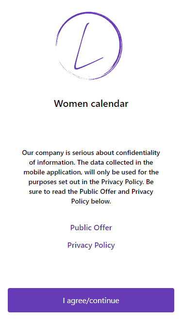
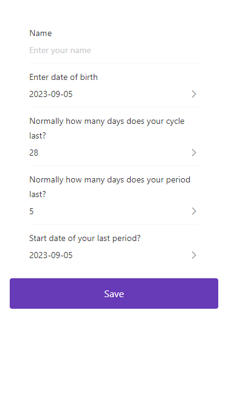
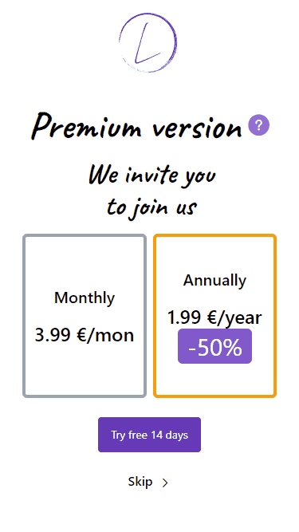
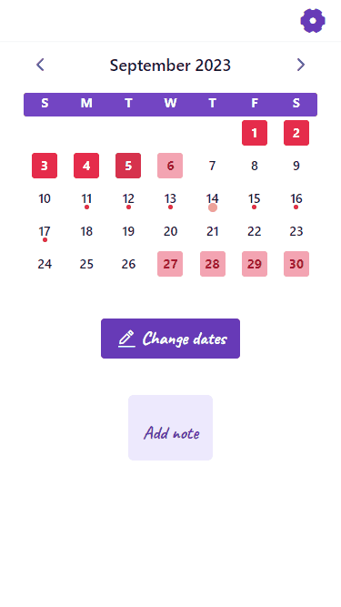
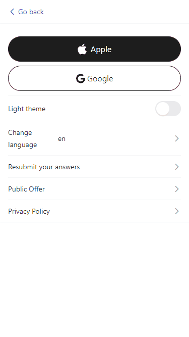
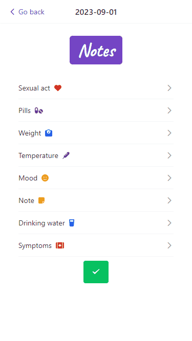

<h1 align="center">Women's Calendar</h1>

## About Project

This application allows you to track data such as:
- mestruation
- fertile days
- ovulation

The application, based on the entered data, calculates the above items.

The application allows you to specify such data as:
- mood
- notes
- drugs taken
- sexual activity
- symptoms
  
It also allows you to track daily water intake, weight and body temperature.
The entered data is subject to change.


## Application view
The initial screen prompts you to read the terms of use of the application and accept these agreements. Then you are given the option to sign in to the app using Google or Apple accounts, or skip this step.

  

 On the next screen, you need to enter data for calculating future periods and other things. After entering the data, you will be taken to the tariff selection screen for using the application. At the moment, this screen carries only visual information and is only a decor. All information on it is fictitious.
 
    
  
 After completing all the preparatory operations, you find yourself on the main screen. The calendar displays all the data based on the values you entered earlier. It is also possible to change some settings, make notes and change the marked periods in the calendar.
 
 

 In the settings, you can change the previously entered values, the language and theme of the application. The application currently supports more than 15 languages. You can also sign in to your Google or Apple accounts if you haven't done so before (this feature isn't implemented in the app yet).



You can also see how the notes look in this application.



## Necessary requirements for installation
- Local server (for example <a href="https://ospanel.io/">Open Server Panel</a>)


## Application installation

Due to the fact that the repository contains both frontend files and backend files, below are the instructions for installing this application.

### Project setup

If you are working with this, then you need to clone the repository to the domains folder and install there.

1. Set up the Laravel directories
```
composer install
```
2. In the top folder copy the .env.example file and under the name .env and enter the following command
```
php artisan migrate
```
Click *yes* on the prompted dialog box to create a database for this application.

3. To start the server, enter 
```
php artisan serve
```
4. Set up Vue directories, but before that you need to go to the folder Vue so that the files will be installed in the location we need
```
cd vue
```
5. Set up the node modules
```
npm install --legacy-peer-deps
```
6. To run the application enter the following command in the terminal
```
npm run serve
```

## Future improvements and updates:
- dark theme debugging
- development of sending push notifications from the server to the system
- connecting the ability to sign in using Google and Apple accounts
